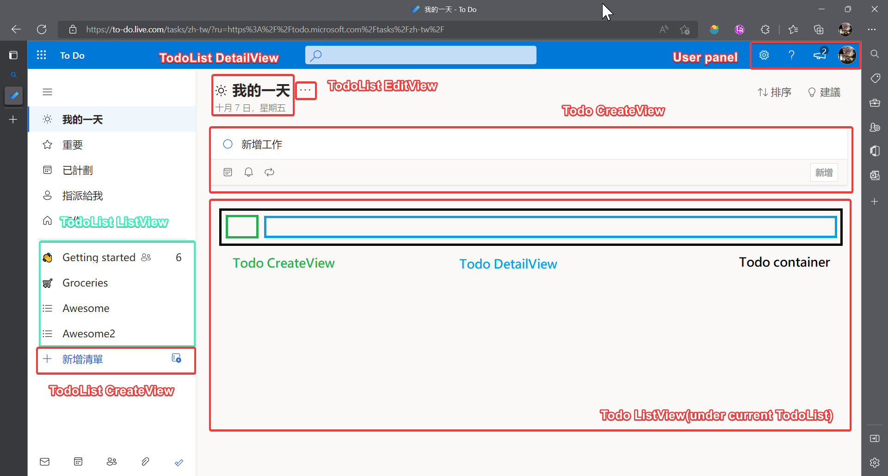

# Practice django TODO

## Objective

- 練習設計模型
  - django orm
- 設計API操作模型的CRUD
  - class view
- 設計一個儀表板顯示todo list
  - 顯示User的所有list
  - (optional)添加登入控制，沒有被登入的user不能操作
  - (optional)添加bootstrape美化
  - 可以增/刪 Todolist
  - 點選 list 可以查看list頁面
  - list底下可以對TODO進行CRUD

## Model 

### User

Django's default user model, It's very important for user authentication.

- [django.contrib.auth | Django documentation | Django](https://docs.djangoproject.com/en/4.1/ref/contrib/auth/#user-model)

#### field

username
first_name
last_name
email
password

---

### TodoList

User's Todo List container.
Each TodoList own by 1 user.
Each User have 0~M TodoList.

#### field

- id
  - **Describe:** 主鍵
  - **Type:** bigint
  - **Range:**
  - **PK:** T
  - **AI:** 
  - **NN:** T
  - **UN:** T
  - **Default:**
  - **Example:**
  - **Django Model Field:** 預設會自動建立
- user_id
  - **Describe:** 外鍵，指向擁有此List的User
  - **Type:** 
  - **Range:**
  - **NN:**
  - **UN:**
  - **Default:**
  - **Example:**
  - **Django Model Field:**
- name
  - **Describe:** TodoList的名稱
  - **Type:**
  - **Range:**
  - **AI:**
  - **NN:**
  - **Default:** ""
  - **Example:** "Shopping List"
  - **Django Model Field:**
- describe
  - **Describe:** 對List的詳細說明
  - **Type:**
  - **Range:**
  - **NN:**
  - **Default:** ""
  - **Example:** "5/20日的旅遊清單"
  - **Django Model Field:**
- create_at
  - **Describe:** 清單建立時間
  - **Type:**
  - **Range:**
  - **NN:**
  - **Default:**
  - **Example:**
  - **Django Model Field:**
- last_modify
  - **Describe:** 最後修改時間
  - **Type:**
  - **Range:**
  - **NN:**
  - **Default:**
  - **Example:**
  - **Django Model Field:**

---

### Todo

Each TodoList has 0~many Todo
Each Todo owned by 1 TodoList.

#### Field

- id
  - **Describe:** 主鍵
  - **Type:** bigint
  - **Range:**
  - **PK:** T
  - **AI:** 
  - **NN:** T
  - **UN:** T
  - **Default:**
  - **Example:**
  - **Django Model Field:** 預設會自動建立
- name
  - **Describe:** 
  - **Type:**
  - **Range:**
  - **AI:**
  - **NN:**
  - **Default:** ""
  - **Example:** "Apple juice*3"
  - **Django Model Field:**

---

## Template

### Dashboard Page

View: [DashboardView](#dashboardview)

---

## View Functions

### [DashBoardView](src/todo_awesome/todo_awesome/views.py)

The main page for user

**Request**
GET '{{BaseURL}}/'

**Response** 

- success 

200 ok

['todo/dashboard.html'](src/todo_awesome/templates/todo_awesome/dashboard.html)

- Fail

### TodoListCreateView

Create a TodoList, Return client to '{{BaseURL}}/'

**Request**

POST '{{BaseURL}}/todolists/create'

params

**Response**

- success

303 redirect 

### TodoListListView

Show all todolist relate to current user.

GET '{{BaseURL}}/api/todolists/list'

### TodoListDetailView

Show detail about TodoList relate to current user.

GET '{{BaseURL}}/todolists/<int: listid>'

### Todo ListView

Show all todos for current

GET '{{BaseURL}}/todos/list'

params:
- 